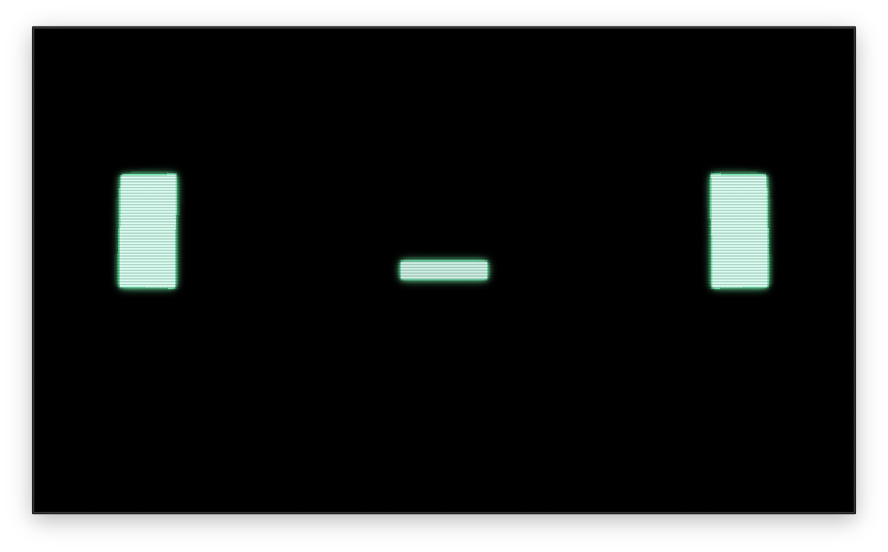

# IC

<p align="center">
  
</p>

A recreation of the IC helper robot from the horror game [ROUTINE](https://store.steampowered.com/app/606160/ROUTINE/).

## Features

- Speaking robotic face with text-to-speech
- Authentic CRT effects (glow, scanlines, flicker, curvature)
- Control via web browser
- Designed for Raspberry Pi kiosk mode

---

# Getting Started

## Quick Start

```bash
git clone https://github.com/scottlivingston/ic.git
cd ic
./setup.sh              # Install dependencies and build
sudo ./kiosk-setup.sh   # Configure auto-login and auto-start
sudo reboot             # Reboot into kiosk mode
```

## Control Panel

Open `http://<pi-ip>:3000` from another device on the network to:

- Click preset phrases to make IC speak
- Type custom text in the input field
- Toggle CRT effects on/off
- Adjust effect intensity with sliders

## Effects

| Effect    | Description                      |
| --------- | -------------------------------- |
| Glow      | Bloom effect around bright areas |
| Scanlines | Horizontal CRT scan lines        |
| Flicker   | Random screen flicker            |
| Curvature | CRT barrel distortion            |
| Grid      | Pixel grid overlay               |

---

# API Reference

Base URL: `http://<pi-ip>:3000/api`

## Endpoints

### GET /health

Health check endpoint.

**Response:** `{"status": "ok"}`

### POST /speak

Make IC speak the given text.

**Request Body:**

```json
{
  "msg": "Hello world"
}
```

**Response:** `200 OK`

### POST /effects

Update CRT effect settings.

**Request Body:**

```json
{
  "glow": true,
  "glow_intensity": 0.5,
  "scanlines": true,
  "scanline_opacity": 0.5,
  "flicker": true,
  "flicker_amount": 0.3,
  "curvature": true,
  "curvature_amount": 50.0,
  "grid": false
}
```

**Response:** `200 OK`

---

# Development

## Requirements

- [mise](https://mise.jdx.dev/)

## Build Commands

| Command             | Description                    |
| ------------------- | ------------------------------ |
| `mise run dev`      | Development mode               |
| `mise run build`    | Release build                  |
| `mise run build-pi` | Cross-compile for Raspberry Pi |

## Architecture

### Components

- **Bevy App**: Main application using Bevy game engine for rendering and ECS
- **Web Server**: Axum HTTP server accepts commands via REST API
- **SAM TTS**: Text-to-speech engine, ported from [sam-js](https://github.com/discordier/sam)
- **Face**: Animated sprite-based face with eyes and mouth
- **CRT Shader**: Post-processing effects (glow, scanlines, flicker, curvature)

### Data Flow

```
HTTP Request (/api/speak)
       ↓
   Web Server (Axum)
       ↓
   SayEvent (Bevy message)
       ↓
   SAM TTS: Text → Phonemes → Audio
       ↓
   Audio Playback (rodio)
       ↓
   Face Animation (mouth syncs to audio)
```
